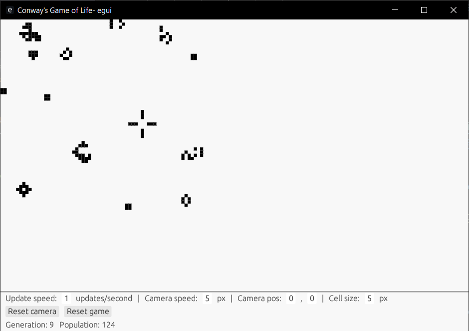

# Conway's Game of Life
Implementation of Conway's Game of Life in Rust.



This implementation features a GUI written using egui. The top part of the window displays the game board/world. The bottom part of the window contains various controls for changing game parameters, as well as displaying some game information.

When the game starts, it will generate a random 64x64 board with its top left corner at (0,0) (the top left corner of the window).

The game works by keeping track of live cells via coordinates and updating the cells surrounding each live cell on each update.

### Technology Used
* [Rust](https://www.rust-lang.org/)
* [rand](https://docs.rs/rand/latest/rand/)
* [egui](https://www.egui.rs/)

---

## Instructions/Getting Started
Run ```cargo run``` to start up an instance of the GUI and run a game.

Use the controls at the bottom of the window to control various game parameters. Use the arrow keys (when no controls are focused) to move the game's camera. 
* Update speed sets a max fps. The game board will update up to this many times per second. For example, if it is set to 30, the board's update function will be called less than or equal to 30 times each second, depending on how many cells are alive and the performance of the machine the game is being run on. Setting update speed to 0 will pause the game.
* Camera speed sets how many pixels the camera moves each time an arrow key is pressed.
* Camera pos sets where the camera is in the game world. It is the position of the top left corner. For example, when the camera position is (0,0), the top left corner of the camera is at world position (0,0).
* Cell size sets the size of each cell in pixels.
* Reset camera sets the camera position to (0,0).
* Reset game deletes the current board and generates a new, random, 64x64 board with its top left corner at (0,0). It does not reset any other controls.
* Generation displays the current generation of the game (or, in other words, how many updates have occurred).
* Population displays the current population of the game.
